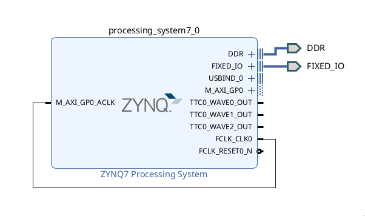
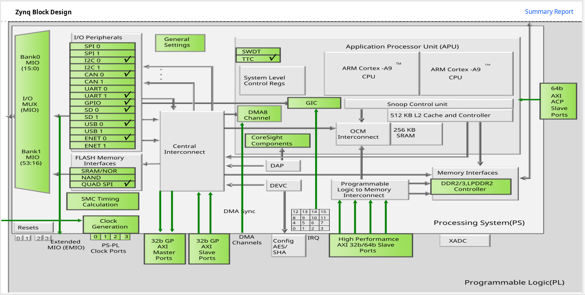

# SoC Project

This project implements an Echo-State Network (ESN) on the ZC702 FPGA’s processing system (SoC). The design features a robust TCP server running on the board that enables a client PC to transfer various files—including matrix and data files—over Ethernet. File transfers and system commands (such as initiating ESN processing or performing a soft reset) are handled using custom headers embedded in the transmitted data. A Python script provides an interactive interface for easily sending these files and commands. Additionally, the board outputs detailed status and debug information via a USB-UART port, allowing real-time monitoring of network activity and ESN computations.

## Setup Instructions

1. **Clone the repository:**
   ```bash
   git clone https://github.com/boernerc20/SoC_Project.git
   cd SoC_Project
2. **Import Project into Vitis**
- Launch **Vitis IDE**.
- Go to **File > Import > Import projects from Git > Existing local repository > Navigate to `ZC702_File` Project**.
- Select the project and click **Finish**.
- For Application Project Settings:
  - Select `base_ps_wrapper.xsa` from the Vivado export located in the `zc702_soc` folder.
  - Make sure it matches your target hardware.


3. **Open a UART Serial Terminal for Debugging**
- Check what COM port the USB-UART cable is connected to
- Minicom for example (PORT would be the actual UART debugger port):
   ```bash
   minicom -D 'PORT' -b 115200
4. **Set up Ethernet Connection**
- Configure your PC to use a static IP on the same subnet as the board.
- For example:
   ```bash
  PC:      192.168.1.99
  ZC702:   192.168.1.10
  Subnet:  255.255.255.0
4.  **Program the FPGA using Vitis**
- To run the code **Right click project in Explorer > Run As > Launch Hardware**
5. **Monitor TCP Server**
- Should see this message in UART terminal:
   ```bash
   -----ESN Core TCP Server Application-----
  Start PHY autonegotiation
  Waiting for PHY to complete autonegotiation.
  autonegotiation complete
  link speed for phy address 7: 1000
  Configuring default IP 192.168.1.10
  Board IP:       192.168.1.10
  Netmask :       255.255.255.0
  Gateway :       192.168.1.1
  TCP server listening on port 5001
- Confirm Ethernet connection by pinging board (Should see no errors and 0% packet loss):
   ```bash
   ping 192.168.1.10
6. **Run Python Script**
- Navigate to `data` folder.
- Run script:
   ```bash
   ./transmit_data.py
7. **Use Script to Interact with Board**
- See **Python Client Script Functionality** section for more information

## Hardware
The hardware and bitstream were synthesized/implemented using Vivado 2023.2. `zc702_soc` houses the Vivado project with the .xsa and .bit files. Automation was run on the ZYNQ7 Processing System IP to use default peripherals for UART, I2C, SD card, and Ethernet functionality.

**Hardware Block Diagram**
<p align="center">
  
</p>

**Zynq 7000 SoC Design**
<p align="center">
  
</p>

## FPGA Board Code Functionality
The board firmware is designed to run on the ZC702 FPGA evaluation board with a Zynq-7000 SoC. It integrates Ethernet communication via the lwIP TCP/IP stack and an Echo State Network (ESN) core for data processing. The TCP/IP stack was created by Xilinx with these files modified or created: `esn_core.h`, `esn_core.c`, `main.c`, `tcp_file.h`,`tcp_command.h`, `tcp_command.c`, `tcp_file.c`, and `tcp_perf_server.c`. Below is a detailed overview of its operation:

1. **Network Initialization**
   - **Ethernet Setup:**  
     The firmware initializes the Ethernet interface, configuring a static IP (default: `192.168.1.10`), netmask, and gateway. DHCP is bypassed if no DHCP server is detected.
   - **PHY Autonegotiation:**  
     The PHY performs autonegotiation to establish a reliable Gigabit link with the host PC.

2. **TCP File Reception**
   - **Buffer & Header:**  
     Incoming data is received on TCP port 5001 and stored in a 3 MB buffer. The first 16 bytes of each transmission form a header containing:
     - An 8-character file ID (e.g., `WIN_____`, `WX______`, `WOUT____`, `DATAIN__`).
     - A 4-byte field specifying the payload size.
     - 4 reserved bytes.
   - **Dynamic Parsing:**  
     Depending on the header, the code parses the payload:
     - **Matrix Files (w_in, w_x, w_out):**  
       Data is stored in fixed static arrays.
     - **DATAIN File:**  
       Data is stored in a dynamically allocated array (using `malloc`). The parser reads the entire file and converts ASCII-encoded floats into binary float values.
     - **DATAOUT File:**  
       Golden data_out file is stored in static array (size: 4 outputs * 6400 samples) to compare y_out of ESN core with and calculate MSE.
   - **Sample Count Determination:**  
     For the DATAIN file, the total number of floats is divided by the number of inputs per sample (40) to determine how many samples are contained in the file. This enables processing of one sample for 40 floats, two samples for 80 floats, etc.

3. **Command Handling and Reset Functionality**
   - **Command Identification:**  
     A second port (5002) is opened on the TCP server to process commands from the Python script. The user can send reset commands to process different data or use different matrices.
   - **Selective Reset:**  
     A soft reset function clears only the DATAIN array (freeing dynamic memory and resetting related flags), while leaving the matrix files intact. This allows new DATAIN files to be loaded without re-sending the unchanged matrices.

4. **ESN Core Integration and Processing Flow**
   - **Modular ESN Core:**  
     The ESN functionality is encapsulated in separate files (`esn_core.h` and `esn_core.c`), which implement:
     - **Update State:**  
       Computes the reservoir state as  
       `state = tanh(W_in * data_in + W_x * state_pre)`.
     - **Form Extended State:**  
       Concatenates the current input and reservoir state into a single vector.
     - **Compute Output:**  
       Calculates the final output by multiplying the extended state vector by the output weight matrix (`W_out`).
   - **Sample-by-Sample Processing:**  
       For DATAIN files containing multiple samples, the firmware iterates over each sample. It updates the reservoir state for each sample—using the output of the previous sample as the new `state_pre`—and computes the ESN output.
   - **Output Verification:**  
     Computed output vectors (4 values per sample) are printed via UART. Custom printing functions format the floats to six decimal places for clear diagnostic output. The average MSE between the final y_out and golden solution is also printed.

## Python Client Script Functionality

The Python client script is designed to interactively send various files and commands over Ethernet (TCP) to the ZC702 board. Its main features include:

1. **Interactive Menu:**  
   - Presents options to send matrix files (w_in.dat, w_x.dat, w_out.dat) individually or all together.
   - Allows sending a DATAIN file all at once or in pre-defined chunks.
   - Once DATAIN is recieved the ESN core computes y_out

2. **TCP-Based Communication:**  
   - Establishes a TCP connection to the board’s fixed IP (default: 192.168.1.10) on port 5001.
   - For file transfers, it constructs a header (8-byte file ID, 4-byte file size, 4 reserved bytes) and sends the file content followed by an EOF marker.
   - For commands (e.g. RDI), they are sent over the second TCP port (5002).

3. **Status Feedback:**  
   - Displays connection status and confirmation messages on the console to indicate when files or commands are successfully sent.
   - Guides the user to provide correct filenames if the file isn’t found locally.

4. **Modular and Expandable Design:**  
   - Uses Python’s built-in modules (socket, struct, time, os) to manage network communications and file I/O.
   - The simple, modular design makes it easy to expand the script’s functionality in the future.

## Useful Resources
- Xilinx Embedded Software Development: https://docs.amd.com/r/en-US/ug1400-vitis-embedded
- Standalone LWIP Library: https://xilinx-wiki.atlassian.net/wiki/spaces/A/pages/18842366/Standalone+LWIP+library
- Integrate an lwIP TCP/IP Stack into Embedded Applications: https://www.analog.com/en/resources/technical-articles/integrate-lwip-tcp-ip-stack-embedded-apps.html
- lwIP Wiki: https://en.wikipedia.org/wiki/LwIP
- Ethernet Communication using TCP protocol in Zynq Processor: https://www.youtube.com/watch?v=8hjhUv_JzWM
- TCP and OSI Model: https://www.youtube.com/watch?v=CRdL1PcherM

